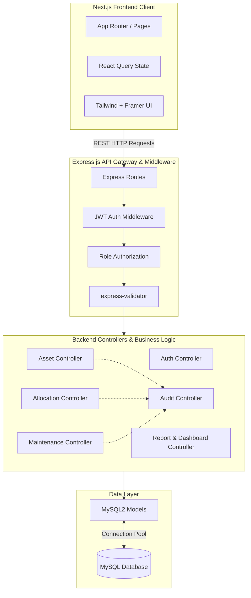
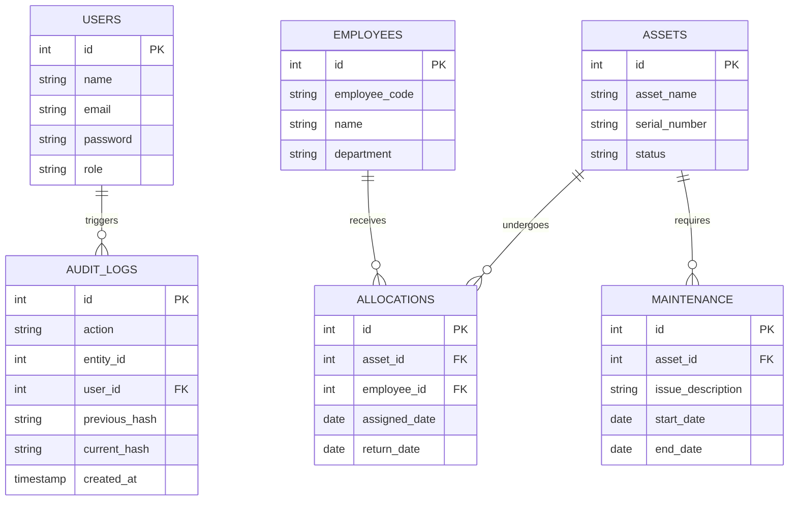

# 🏛️ Comprehensive Architecture & Implementation Details
## Enterprise Asset Management System

This document outlines the complete system architecture, module-by-module implementation details, and database relationships based on the fully developed state of the codebase.

---

## 1. Global System Architecture

The application implements a robust **Model-View-Controller (MVC)** design pattern on the backend and utilizes a **Component-Based Architecture** on the frontend, forming a standard 3-Tier Enterprise Application.

### 1.1 High-Level Architecture Diagram

---

## 2. Module-by-Module Implementation Details

The system is cleanly decoupled into 9 distinct modules. Each module has its own Frontend Page, Backend Route, Controller, and Model.

### 2.1 🔐 Authentication & Users Module
**Frontend**: `(auth)/login`, `(dashboard)/users` | **Backend**: `authRoutes.js`, `userRoutes.js`
*   **Implementation**: Handles stateless authentication using JSON Web Tokens (JWT). Passwords are cryptographically hashed using `bcrypt` before storage.
*   **RBAC**: Users are assigned roles (Admin, Employee). Custom middleware (`authorize`) restricts destructive actions (POST, PUT, DELETE) to Admins.
*   **User Directory**: Admins can manage system users through the dedicated Users module.

### 2.2 💻 Asset Management Module
**Frontend**: `(dashboard)/assets` | **Backend**: `assetRoutes.js`
*   **Implementation**: Core CRUD operations for managing physical (laptops, monitors) and IT assets.
*   **State Tracking**: Each asset has a dynamic `status` (Available, Assigned, Maintenance) that updates automatically when acted upon by other modules.

### 2.3 👥 Employee Directory Module
**Frontend**: `(dashboard)/employees` | **Backend**: `employeeRoutes.js`
*   **Implementation**: Manages the company roster. Stores `employee_code`, `department`, and `designation`.
*   **Validation**: Strict input validation using `express-validator` to ensure proper email formats and mandatory fields are provided.

### 2.4 🔄 Asset Allocation Module (Core Business Logic)
**Frontend**: `(dashboard)/allocations` | **Backend**: `allocationRoutes.js`
*   **Implementation**: Handles the checkout/check-in of assets to employees.
*   **Concurrency & Integrity**: 
    *   Checks if an asset's status is `Available` before allocation.
    *   Uses **SQL Transactions** (`START TRANSACTION`, `COMMIT`, `ROLLBACK`) to simultaneously update the `assets` table status and insert a new record into the `allocations` table. If one fails, the entire action reverts to prevent data corruption.
    *   Records allocation and return dates for historical tracking.

### 2.5 🛠️ Maintenance Module
**Frontend**: `(dashboard)/maintenance` | **Backend**: `maintenanceRoutes.js`
*   **Implementation**: Tracks asset repair logs. When an asset is sent for repair, its status is updated to `Maintenance`, preventing it from being allocated. When maintenance is completed, it reverts to `Available`.

### 2.6 📊 Dashboard & Reporting Modules
**Frontend**: `(dashboard)/dashboard`, `(dashboard)/reports` | **Backend**: `dashboardRoutes.js`, `reportRoutes.js`
*   **Implementation**: Aggregates data from across the system to provide actionable analytics.
*   **Queries**: Uses complex SQL `JOIN` and `GROUP BY` queries to calculate total assets, active allocations, assets in maintenance, and departmental distribution.

### 2.7 🔗 Blockchain-Inspired Audit Trail Module
**Frontend**: `(dashboard)/audit` | **Backend**: `auditRoutes.js`
*   **Implementation**: A cryptographic ledger embedded in a relational database.
*   **Mechanism**: Every state-changing action (Create Asset, Allocate Asset, Return Asset) triggers an audit log. The system serializes the event data, retrieves the `current_hash` of the previous audit log, and generates a new SHA-256 hash chaining them together.
*   **Tamper-Evidence**: Provides ultimate transparency. If an administrator manually edits a database row, recalculating the hash chain will expose the tampering.

---

## 3. Database Schema & ERD

The relational structure seamlessly ties these modules together:

---

## 4. Frontend Application Structure (Next.js App Router)

The frontend leverages Next.js App Router conventions:

*   **`layout.js`**: Houses the global sidebar, navigation, and authentication context providers.
*   **`(auth)/`**: Route group bypassing the dashboard layout for login screens.
*   **`(dashboard)/[module]/page.js`**: Dedicated pages for each module (`/assets`, `/allocations`, `/audit`, etc.).
*   **Data Fetching**: Utilizes `@tanstack/react-query` to fetch data from the Express backend, providing automatic caching, loading states, and optimistic UI updates for a snappy user experience.
