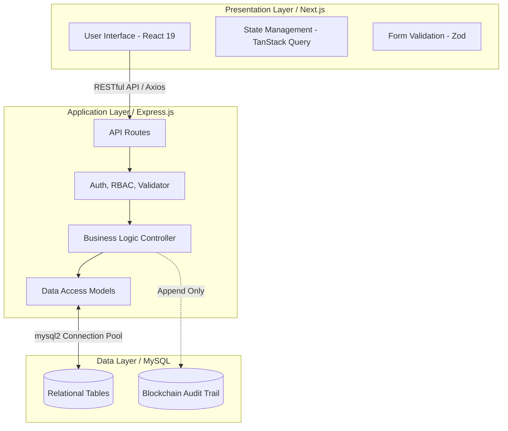
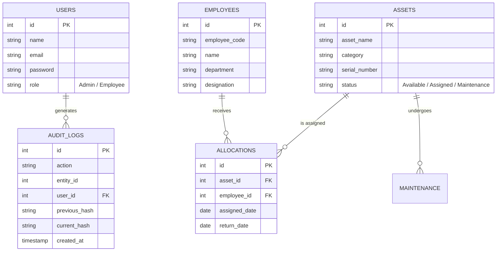

# 🏗️ System Design Document (SDD)
## Enterprise Asset Management System

---

## 1. Introduction

### 1.1 Purpose
This document provides a comprehensive architectural and system design overview of the Enterprise Asset Management System. It is intended for developers, architects, and stakeholders to understand the underlying infrastructure, data flow, and security mechanisms of the application.

### 1.2 Scope
The system manages physical and IT assets, employee allocations, and maintenance schedules. A key distinguishing feature is the integration of a **blockchain-inspired tamper-evident audit log** implemented within a relational database, providing ultimate tracking transparency without the overhead of a decentralized ledger.

---

## 2. System Architecture

The application adopts a **3-Tier Architecture** encompassing the Presentation Layer, Application Layer, and Data Access Layer. It strictly follows the **Model-View-Controller (MVC)** design pattern on the backend.

### 2.1 Component Diagram



### 2.2 Technology Stack
*   **Frontend**: Next.js (React 19), Tailwind CSS v4, Framer Motion, `@tanstack/react-query`, Zod, React Hook Form.
*   **Backend**: Node.js, Express.js v5.
*   **Database**: MySQL (using `mysql2/promise` with connection pooling).
*   **Security**: JSON Web Tokens (JWT) for stateless authentication, `bcrypt` for password hashing.

---

## 3. Database Design

The database is normalized to ensure data integrity and avoid redundancy.

### 3.1 Entity Relationship (ER) Model



### 3.2 Data Access Strategy
*   **Connection Pooling**: Uses `mysql2` pool to manage concurrent database connections efficiently, preventing connection exhaustion under heavy load.
*   **Transactions**: Critical operations (like Allocations) utilize SQL transactions (`START TRANSACTION`, `COMMIT`, `ROLLBACK`) to guarantee ACID properties. E.g., updating an asset's status to "Assigned" and creating an allocation record must succeed or fail together.

---

## 4. Security & Audit Design

### 4.1 Authentication and Authorization
1.  **Authentication**: Stateless authentication using JWT. Tokens are issued upon successful `bcrypt.compare()` validation of user credentials.
2.  **Authorization (RBAC)**: Middleware inspects the decoded JWT payload.
    *   `Admin`: Full CRUD access to all modules.
    *   `Employee`: Read-only access to specific endpoints.

### 4.2 Blockchain-Inspired Audit Trail
To guarantee the integrity of historical asset data, the system implements cryptographic hash chaining.

*   **Immutability Logic**: Every `CREATE`, `UPDATE`, `DELETE`, `ALLOCATE`, or `RETURN` action triggers an audit log insertion.
*   **Hash Chaining Process**:
    1. Retrieve `current_hash` from the last inserted log (or `"000000000"` for genesis).
    2. Serialize the new event data (Action, User, Entity).
    3. Generate new hash: `SHA-256(Previous Hash + Event Data)`.
    4. Store the log.
*   **Tamper Evidence**: If a malicious actor alters a database row directly in MySQL, recalculating the hash chain will immediately fail at the tampered block, alerting administrators.

---

## 5. API Design Strategy

The system exposes a standard RESTful API.

### 5.1 API Middleware Pipeline
Every request passes through a centralized pipeline:
1.  **CORS**: Cross-Origin Resource Sharing configuration.
2.  **JSON Parser**: Express built-in JSON body parser.
3.  **Authentication Guard (`authMiddleware`)**: Verifies JWT.
4.  **Role Guard (`authorize`)**: Validates user permissions.
5.  **Request Validator**: Uses `express-validator` to sanitize and validate input body/params.
6.  **Controller**: Wraps business logic in an `asyncHandler`.
7.  **Global Error Handler**: Catches any unhandled promise rejections or validation errors and formats them into a standardized JSON response.

### 5.2 Error Handling Standard
```json
// Standardized API Error Response
{
  "success": false,
  "message": "Asset is already assigned to another employee",
  "stack": "..." // Only visible in non-production environments
}
```

---

## 6. Frontend / UI Design Approach

### 6.1 State Management
*   **Server State**: Handled exclusively by `@tanstack/react-query` for automatic caching, background fetching, and optimistic updates.
*   **Client State**: Local component state (`useState`) for UI toggles (modals, dropdowns).

### 6.2 Forms and Validation
*   Forms are managed using **React Hook Form** to minimize re-renders.
*   **Zod** is used as the schema validator, allowing exact schema sharing (or mirroring) between the React frontend and the Express backend.

### 6.3 Aesthetics
*   The UI prioritizes a clean, enterprise-grade aesthetic utilizing **Tailwind CSS**.
*   **Framer Motion** provides micro-interactions (e.g., smooth modal openings, list transitions) to elevate the user experience.

---

## 7. Scalability and Future-Proofing

*   **Stateless Backend**: The Express server is entirely stateless (sessions stored in JWTs), allowing it to be horizontally scaled behind a load balancer easily.
*   **Modular Architecture**: The codebase is strictly organized by feature (Assets, Employees, Auth). Adding new modules (like a Procurement or Software License module) requires zero refactoring of existing code.
