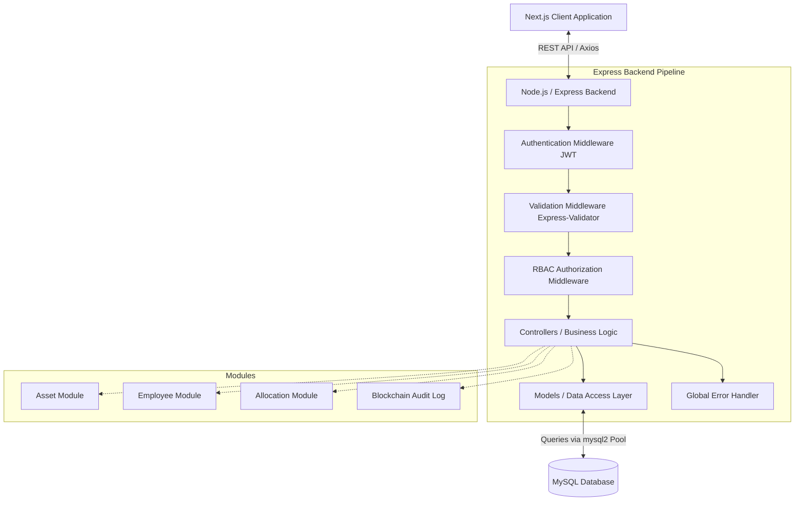
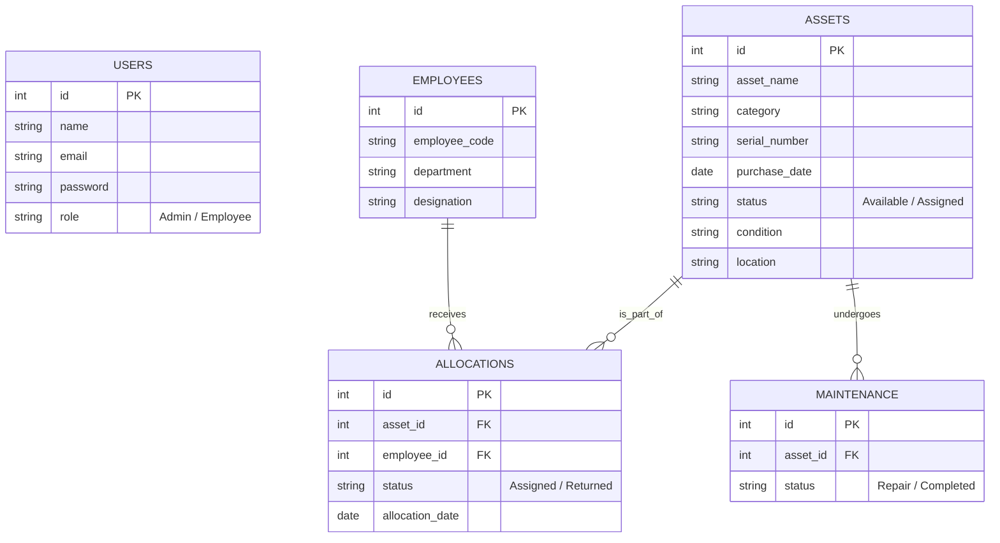

# Enterprise Asset Management System - System Design Document

## 1. Executive Summary
The **Enterprise Asset Management System** is a full-stack, highly secure application designed to track and manage company IT and physical assets (e.g., laptops, monitors, peripherals). It manages the complete lifecycle of assets including inventory, employee allocation, maintenance schedules, and introduces a unique **blockchain-inspired tamper-evident audit trail** to ensure data integrity and track historical modifications securely.

---

## 2. System Architecture

The application adopts a standard **Client-Server Architecture** utilizing a **Model-View-Controller (MVC)** design pattern on the backend for clean separation of concerns.

### Key Architectural Decisions
- **Connection Pooling**: Uses `mysql2/promise` pool to reuse database connections, minimizing overhead and increasing concurrent performance.
- **Centralized Middleware Chain**: Every request flows through authentication, validation, and authorization layers before hitting business logic.
- **Global Error Handling**: `asyncHandler` wrappers funnel all exceptions to a centralized error middleware, ensuring uniform API responses and preventing server crashes.

---

## 3. Technology Stack

### Frontend (Client)
- **Framework**: Next.js (React 19)
- **Styling**: Tailwind CSS v4, `clsx`
- **State Management & Fetching**: `@tanstack/react-query`, Axios
- **Form Handling**: React Hook Form with `zod` for validation
- **UI & Animations**: Framer Motion, Lucide React, Recharts, React Hot Toast

### Backend (Server)
- **Runtime**: Node.js
- **Framework**: Express.js (v5)
- **Database**: MySQL (relational database mapped via `mysql2`)
- **Security**: `bcrypt` (password hashing), `jsonwebtoken` (session state), `cors`
- **Validation**: `express-validator`

---

## 4. Database Schema Design

The database (`asset_management`) is highly normalized to minimize data redundancy.

> [!TIP]
> **Database Normalization**
> The relationship structure avoids duplicating employee or asset data by connecting them through the `allocations` associative entity, leveraging Foreign Keys to ensure referential integrity.

---

## 5. Security and Compliance

### Authentication & RBAC (Role-Based Access Control)
- **JWT (JSON Web Tokens)**: Stateless authentication. Tokens are verified on every secure route.
- **Roles**:
  - `Admin`: Full CRUD capabilities across assets, employees, and allocations.
  - `Employee`: Read-only access to view asset availability and details.

### Blockchain-Inspired Audit Trail
A standout feature of the system is the practical application of blockchain principles (hash chaining) within a traditional centralized SQL database to ensure data integrity.

> [!IMPORTANT]
> **How It Works**
> Every critical mutation (CREATE, UPDATE, DELETE, ALLOCATE, RETURN, MAINTENANCE) generates an immutable block in the audit table.
> - **Previous Hash**: Points to the SHA-256 hash of the preceding event.
> - **Current Hash**: A SHA-256 hash generated from the event data combined with the previous hash.

**Benefits**:
1. **Tamper-Evident**: If a malicious actor alters a database row manually, the hash chain breaks, making the tampering immediately obvious upon system verification.
2. **Asset Timeline**: Provides a complete, historically accurate lifecycle for every asset in the system.

---

## 6. Core Modules and API Design

The application follows RESTful conventions. 

### 6.1 Authentication Module
- `POST /api/auth/register` - Registers a new user, hashes password via `bcrypt`.
- `POST /api/auth/login` - Validates credentials, issues JWT.

### 6.2 Asset Module
- `GET /api/assets` - Retrieve all assets.
- `GET /api/assets/:id` - Retrieve specific asset details.
- `POST /api/assets` - Create a new asset *(Admin Only)*.
- `PUT /api/assets/:id` - Update asset properties *(Admin Only)*.
- `DELETE /api/assets/:id` - Delete an asset *(Admin Only)*.

### 6.3 Employee Module
- Complete CRUD API identical in structure to Assets, mapping to the `employees` table.

### 6.4 Asset Allocation Module (Upcoming)
- Assigns assets to employees using **MySQL Transactions** to guarantee atomicity (e.g., updating the asset status to `Assigned` and creating the allocation record must succeed or fail together).
- Prevents double allocation of assets.

---

## 7. Data Validation & Error Handling

> [!NOTE]
> **Validation Pipeline**
> The system utilizes a dual-validation strategy to prevent bad data.

1. **Frontend Validation**: `zod` combined with `react-hook-form` ensures data is well-formatted before the API call is made.
2. **Backend Validation**: `express-validator` acts as a second line of defense against bypassed client validation or direct API attacks.

**Global Error Handler**:
By wrapping all async controller logic in a custom `asyncHandler` utility, all uncaught promise rejections and intentional errors are passed to `errorMiddleware.js`. This guarantees that the client always receives a structured JSON response (e.g., `{ "status": "error", "message": "..." }`) rather than a stack trace or HTML error page.

---

## 8. Future Roadmap

- **Dashboard Integration**: Implementation of Recharts on the frontend to visualize asset statistics (e.g., Assigned vs. Available, Assets by Category).
- **Maintenance Module**: Track when assets are sent for repair, estimating return dates and calculating depreciation/repair costs.
- **Reporting**: Export capabilities for audit logs and asset lists (PDF/CSV).
- **Production Deployment**: Containerizing the application using Docker and deploying the Node.js/Next.js stack to a cloud provider with a managed MySQL instance.
