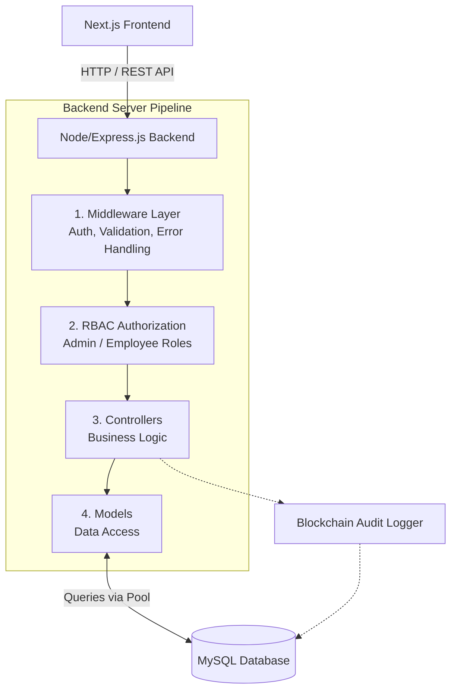
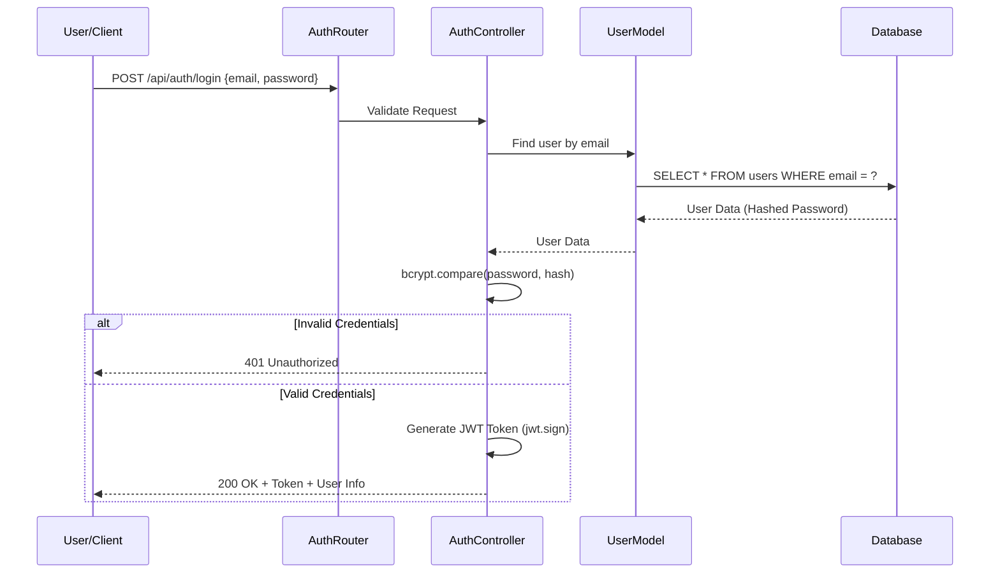
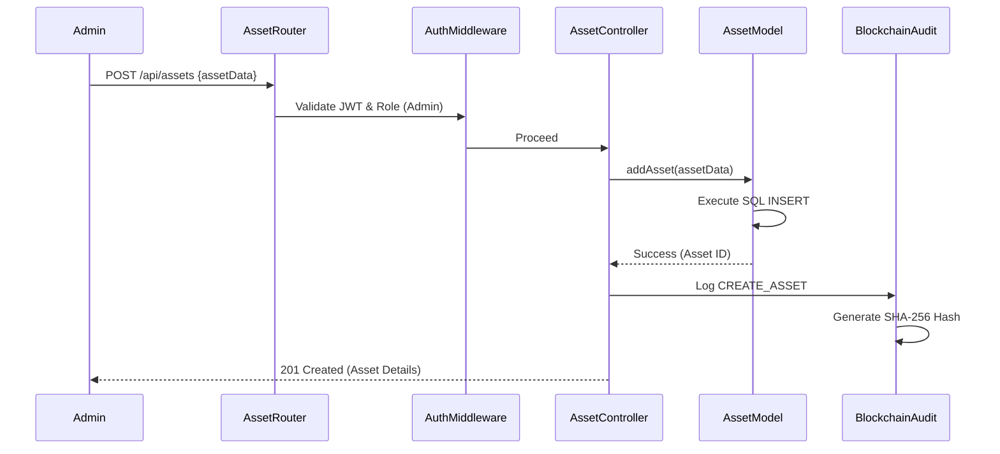
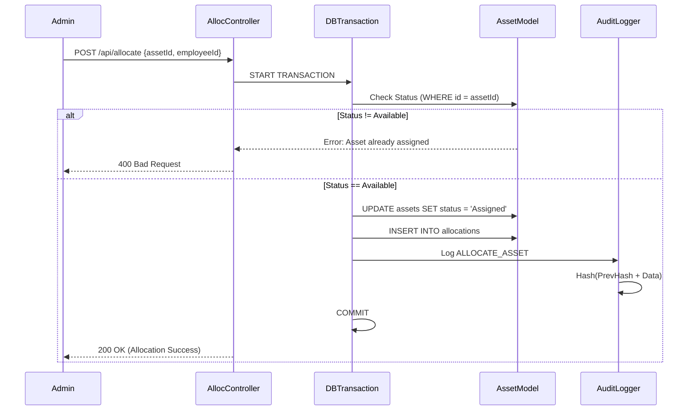

# 🔄 Asset Management System - Workflow & Low-Level Design (LLD)

## 1. System Overview
The Enterprise Asset Management System is designed to securely manage company assets, track employee assignments, and maintain an immutable audit trail using blockchain principles. The system follows a Model-View-Controller (MVC) architecture with a Next.js frontend and an Express.js backend connecting to a MySQL database.

---

## 2. High-Level Architecture (HLD)

---

## 3. Detailed Workflows (LLD)

### 3.1 Authentication & Authorization Workflow
Manages secure access to the system using JWT and bcrypt.

### 3.2 Asset Management (CRUD) Workflow
Only authenticated Admins can create, update, or delete assets. Employees have read-only access.

### 3.3 Employee Directory Workflow
Manages the onboarding and tracking of employees.

**Workflow Steps:**
1. **Request:** Admin sends `POST /api/employees` with employee details.
2. **Validation:** `express-validator` checks for valid email format, phone, and required fields.
3. **Controller Processing:** Calls `employeeModel.createEmployee()`.
4. **Database Execution:** Inserts employee into the `employees` table.
5. **Audit Logging:** System logs the `CREATE_EMPLOYEE` action into the blockchain audit trail.
6. **Response:** Returns the newly created employee profile.

### 3.4 Asset Allocation Workflow (Core Business Logic)
Ensures assets are properly checked out to employees without double assignments.

### 3.5 Blockchain-Inspired Audit Trail Workflow
Provides an immutable ledger of all critical actions.

**Workflow Steps:**
1. **Action Triggered:** An action like `CREATE_ASSET`, `UPDATE_ASSET`, `ALLOCATE_ASSET`, or `RETURN_ASSET` occurs.
2. **Fetch Previous Hash:** The system retrieves the `current_hash` of the latest entry in the `audit_logs` table. If it's the genesis block, it uses `"000000000"`.
3. **Data Preparation:** The action type, entity ID (e.g., asset ID), user ID, and timestamp are serialized.
4. **Hash Generation:** 
   `Current Hash = SHA256(Previous Hash + Serialized Data)`
5. **Insertion:** The new log entry is inserted into the `audit_logs` table.
6. **Tamper Verification (Optional API):** An endpoint recalculates the chain from the beginning to ensure no records have been altered.

---

## 4. Database Schema Relationships (ERD Concept)

- **`users` (1) ---> (M) `audit_logs`**: A user (Admin) performs many audited actions.
- **`employees` (1) ---> (M) `allocations`**: An employee can be assigned multiple assets over time.
- **`assets` (1) ---> (M) `allocations`**: An asset has a history of being allocated to different employees.
- **`assets` (1) ---> (M) `maintenance`**: An asset can have multiple maintenance records.

*Note: All data modification queries utilize the `mysql2` connection pool and `async/await` for optimal performance and reliability.*
